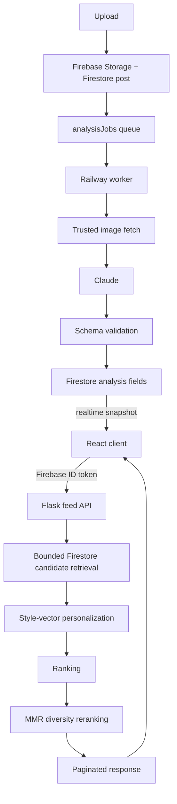

# FitFeed

A social feed for outfit photos, with a recommendation system that learns
what you actually like and an AI analysis pipeline that labels every post.

React + TypeScript + Vite on the front, Flask on Railway for the API and a
background worker, Firebase (Auth, Firestore, Storage, Hosting) underneath,
and Claude for image analysis.

**Live:** https://fitfeed-67ee8.web.app — note that the hosted build predates
the hardening described below; the code here is ahead of the deployment.

---

## Why it exists

It started as a capstone project: post a fit, get likes. The interesting
problem turned out not to be the CRUD but everything around it — how do you
decide what to show someone, how do you learn taste from behaviour without
building a surveillance system, and how do you run an expensive, slow,
failure-prone AI call reliably inside a web app.

## What is technically interesting

- **Server-trusted candidate retrieval.** The client used to fetch every post
  and rank them in the browser, which meant the ranking inputs were whatever
  the client said they were. Ranking now happens behind an authenticated API
  over a bounded Firestore query, with opaque cursor pagination.
- **A recommendation pipeline you can read.** Log-saturating engagement
  quality, a freshness multiplier, deterministic per-user exploration (seeded
  SHA-256, not `random()`), style vectors over a closed vocabulary, decaying
  user taste vectors, and greedy MMR reranking for diversity. Every ranked
  post carries the factors that produced its score.
- **Recommendation signals, not analytics.** Impressions, dwell buckets and
  explicit "more like this" / "not interested" — stored per user, readable
  only by that user, deduplicated by construction so a post cannot contribute
  unlimited signal, and carrying nothing about device, IP, session or
  referrer.
- **Durable AI jobs.** Analysis is a leased Firestore-backed queue drained by
  a separate Railway worker, with an attempt budget, classified permanent vs
  transient failures, and bounded exponential backoff. Closing the browser
  cannot cancel it; a redeploy cannot run it twice.
- **Authorization tested adversarially.** The Firestore and Storage rules have
  their own attack suite — counter manipulation, cross-tenant writes, forged
  document ids, replayed transactions. Several tests exist because they once
  failed.

## Architecture at a glance



Full detail in [docs/architecture.md](docs/architecture.md).

| Doc | What is in it |
| --- | --- |
| [Architecture](docs/architecture.md) | Components, data model, both request paths |
| [Recommendation system](docs/recommendation-system.md) | The scoring maths, and what it does not claim |
| [Security](docs/security.md) | Threat model, controls, accepted limitations |
| [Testing](docs/testing.md) | The test layers and the adversarial ones |
| [Deployment](docs/deployment.md) | Safe release order, migrations, rollback |

---

## Production hardening / engineering evolution

The first release worked. It also trusted the client, ran a 20-second model
call inside an HTTP request, and stored every liker in an array on the post
document. Most of the work in this repository is the second pass — the one
where you find out what your first design actually assumed.

| Before | After |
| --- | --- |
| Client fetched all posts and ranked them | Server-trusted candidate retrieval behind an authenticated, paginated API |
| AI analysis ran inside the request, tied to the browser tab | Durable leased job queue drained by a background worker |
| `likedBy: [uid, ...]` array on every post | `posts/{id}/likes/{uid}` subcollection with transactional counters |
| Category counters as the personalization signal | Style vectors and decaying user taste vectors |
| Broad Firebase rules | Adversarially tested authorization, with mutation-tested rules |
| Backend fetched any image URL the client supplied | Trusted-host fetch with size, type and pixel-count limits |
| Basic smoke tests | Layered security, concurrency, integration and contract tests |

Along the way: a Wilson score interval being used for something it does not
measure, `random()` in a ranking function, a counter that could be moved
without a matching like, a decay function that silently never decayed
anything a browser wrote, and an admin endpoint that would run an unbounded
number of paid API calls on a single request. Each is documented where it was
fixed.

---

## Running it

Prerequisites: Node 20.19+, Python 3.12+, Java 21+ (for the Firebase
emulators), and the Firebase CLI.

```bash
cd fit-feed
npm ci

python -m venv python-backend/venv
python-backend/venv/Scripts/pip install -r python-backend/requirements-dev.txt   # Windows
# python-backend/venv/bin/pip install -r python-backend/requirements-dev.txt     # macOS/Linux

cp python-backend/.env.example python-backend/.env   # then fill it in

npm run dev      # frontend + API + analysis worker together
```

`npm run dev` starts three processes. The worker is optional locally — without
it, uploaded posts sit at "Queued" instead of being analysed.

## Running the CI suite locally

`npm run verify` runs what CI runs, in the same order:

```bash
npm run typecheck      # tsc -b
npm run lint           # eslint . --max-warnings 0
npm run build          # vite build
npm run check:secrets  # tracked-file and secret-pattern hygiene
npm run test:rules     # Firestore + Storage rules and component tests (emulators)
npm run check:skips    # refuses a run that skipped anything
npm run test:backend   # pytest under the Firestore emulator
npm run test:evaluate  # offline recommendation evaluation harness
```

The Playwright suites need the API running, so they are separate:

```bash
npm run dev:backend &
npx playwright test --project=api
npx playwright test --project=ui
```

CI additionally sets `FITFEED_FORBID_SKIPS=1`, which makes a skipped test a
failure. The emulator-backed and API suites skip themselves when their
dependency is missing — useful locally, a false green in CI.

## Repository layout

```
fit-feed/
  src/                  React client
  tests/rules/          Firestore and Storage rule tests (adversarial)
  tests/components/     Component tests (jsdom)
  tests/*.spec.ts       Playwright UI and API contract suites
  python-backend/       Flask API, recommendation engine, analysis worker
  firestore.rules       Authorization for every collection
  storage.rules         Upload authorization
docs/                   Architecture, recommendation, security, testing, deployment
.github/workflows/ci.yml
```
