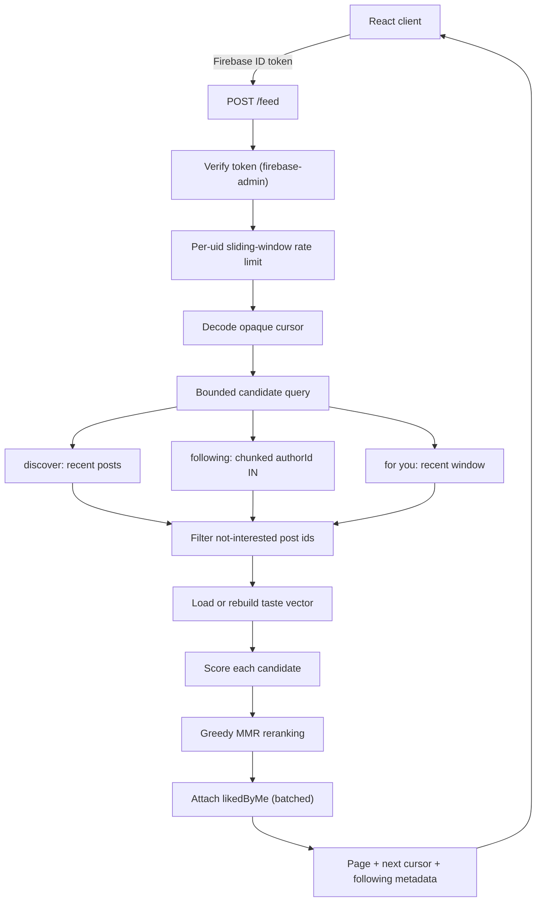
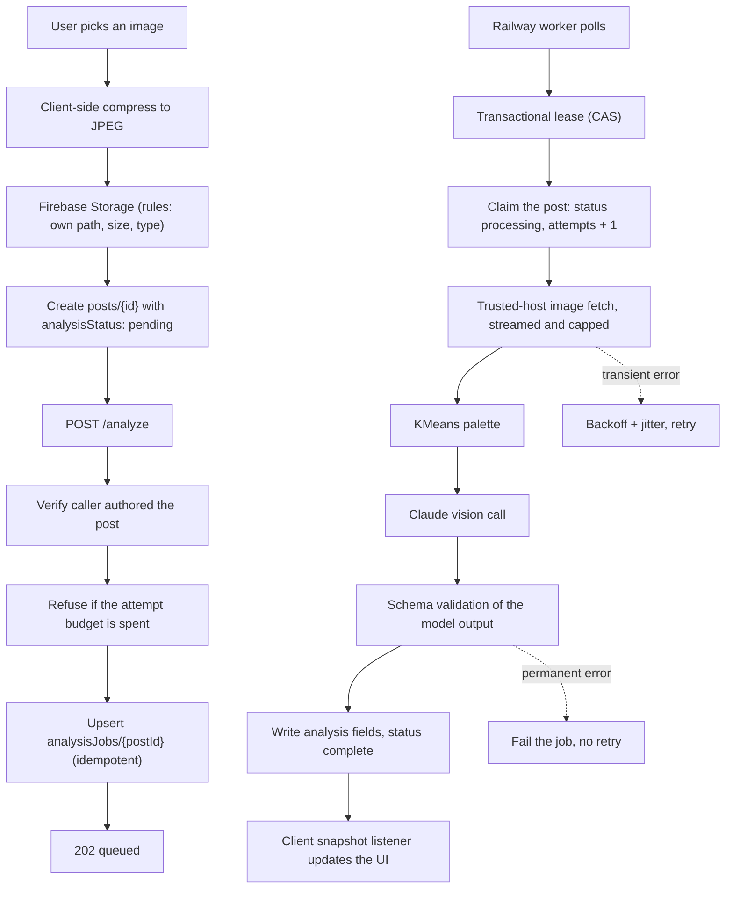

# Architecture

Three deployables and one datastore.

| Piece | Runs on | Responsibility |
| --- | --- | --- |
| React client | Firebase Hosting | UI, auth, realtime post subscriptions, interaction signals |
| Flask API (`web`) | Railway | Authenticated feed, trending, interactions, job enqueue |
| Analysis worker | Railway | Drains the analysis queue; the only process that calls Claude |
| Firestore / Storage / Auth | Firebase | Data, images, identity — and the authorization boundary |

The client talks to Firestore directly for reads and for writes it owns
(likes, comments, saves, its own interaction signals). It talks to the Flask
API for anything that must not be client-decided: which posts appear in the
feed and in what order, and enqueuing paid work.

That split is deliberate. Firestore rules are the authorization boundary for
user-owned data, so routing simple writes through a server would add latency
without adding safety. Ranking is different — a client that can choose its
own candidates can choose its own feed.

## The feed path

Properties worth knowing:

- **Nothing about a post comes from the request body.** The client sends a
  mode, a page size and a cursor. Post data is read server-side.
- **Every query is bounded.** `CANDIDATE_WINDOW` caps the retrieval; the
  following mode chunks author ids into at most 10 `IN` queries of 10.
- **Cursors are opaque and mode-bound.** Base64url JSON carrying the sort
  key, bound to the mode and category it was issued for, so a cursor cannot
  be replayed against a different query shape.
- **The taste vector is cached** in `userTasteVectors/{uid}` and rebuilt when
  the generation marker moves or the TTL expires — one document read on the
  common path instead of a fan-out per request.

### Following more than 100 accounts

Firestore `IN` takes 10 values; the code issues at most 10 such queries, so
100 authors is the hard ceiling per request. Rather than silently dropping
everyone past the hundredth, `select_followed_authors` sorts the follow list
and rotates it by a per-user, per-day SHA-256 offset. Within a day the sample
is stable; across days every followed account comes around. The response
carries `followingTotal` and `followingSampled` so the client can say so
rather than pretending the feed is complete.

## The upload and analysis path

The post id **is** the job id. Enqueuing the same post twice updates one
document rather than buying a second model call, and the attempt counter
survives re-enqueue so retries cannot be farmed.

## Data model

| Path | Written by | Notes |
| --- | --- | --- |
| `posts/{postId}` | Author (content), server (analysis fields) | Analysis fields are server-owned; rules refuse client writes to them |
| `posts/{postId}/likes/{uid}` | The liker | Document id is the uid, so one like per user is a schema property |
| `comments/{commentId}` | Author | `lastCommentId` on the post ties a counter step to a real comment |
| `saves/{uid}_{postId}` | Owner | Composite id prevents claiming someone else's save |
| `follows/{follower}_{following}` | Follower | Composite id prevents claiming a relationship the payload denies |
| `users/{uid}` | Owner | Private profile, including email |
| `publicProfiles/{uid}` | Owner | Handle and avatar only — no email, to stop enumeration |
| `users/{uid}/interactions/{type}_{postId}` | Owner only | Recommendation signals; id derived from (type, post) |
| `userTasteState/{uid}` | Owner only | Monotonic cache-invalidation marker |
| `userTasteVectors/{uid}` | Server | Cached taste vector |
| `analysisJobs/{postId}` | Server only | Clients may read their own post's job; `allow write: if false` |

### Counters

`likesCount` and `commentsCount` are denormalised, which means they can drift
or be manipulated. Both are constrained by rules rather than trusted:

- A like counter may only move by ±1, and only in the same commit as the
  caller's own like document appearing or disappearing (`getAfter` /
  `existsAfter` against post-commit state).
- A comment counter may only move by +1 alongside a `lastCommentId` naming a
  comment that exists after the commit.

Neither can be moved on its own, and neither can be moved on behalf of
another user.

## Indexes

Composite and collection-group indexes live in `firestore.indexes.json`:

| Collection | Fields | Used by |
| --- | --- | --- |
| `posts` | `category`, `createdAt desc` | Category browsing |
| `posts` | `authorId`, `createdAt desc` | Profile grids, following feed |
| `comments` | `postId`, `createdAt asc` | Comment threads |
| `likes` (group) | `uid` | Taste rebuild — every post a user liked |
| `analysisJobs` | `status`, `availableAt` | Worker: what is due |
| `analysisJobs` | `status`, `leaseExpiresAt` | Worker: reclaim abandoned leases |
| `interactions` | `type`, `createdAt desc` | Not-interested filtering |

These must be deployed **before** the code that queries them — see
[deployment.md](deployment.md).
