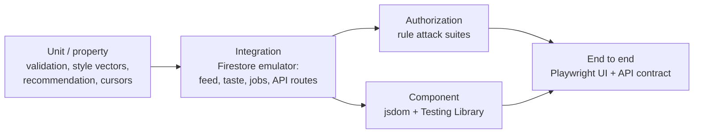

# Testing

The suite is layered by what each layer can actually prove. A unit test
cannot tell you whether your security rules are correct; a browser test
cannot tell you whether a transaction is idempotent under contention. So
there are several kinds, and they are deliberately different.



| Layer | Where | Runs against |
| --- | --- | --- |
| Firestore rule attack tests | `tests/rules/` | Firestore emulator |
| Storage rule tests | `tests/rules/storage.rules.test.ts` | Storage emulator |
| Backend unit + integration | `python-backend/tests/` | Firestore emulator |
| Component | `tests/components/` | jsdom |
| Browser | `tests/auth.spec.ts`, `tests/feed.spec.ts` | Chromium + Vite |
| API contract | `tests/api.spec.ts` | A live Flask process |

## Authorization tests are written as attacks

The rule suites are not "can Alice write her own post". They are attempts to
do the thing the rules exist to prevent, and a good number of them exist
because they once succeeded.

`tests/rules/counters.attack.test.ts` covers counter manipulation:
incrementing `likesCount` without a like document, liking twice, unliking
someone else's like, moving `commentsCount` without a comment, and
concurrency — two users liking at once, one user double-clicking, a like and
a comment landing in the same instant. After each, the suite reads the post
back and asserts the counter and the documents still agree.

`tests/rules/interaction.invariants.test.ts` is the Phase-7 audit, one
`describe` per invariant: the document id must equal `type + '_' + postId`;
the type must be in a closed enum; `postId` and `type` are immutable after
creation; no extra fields; the referenced post must exist; nobody can read or
write another user's signals; the taste-generation marker moves forward only,
by a bounded step, and cannot be deleted. It also asserts the *atomicity*
property directly: a like, save, unsave, comment and explicit-feedback write
each commit together with their invalidation, and a rejected mutation leaves
the marker untouched.

### Mutation testing

Two rule changes were validated by breaking them on purpose and confirming
the suite noticed:

- The old `commentsCount` rule permitted a free ±1 step. Against that
  version, the current suite fails in 10 places.
- Removing the `getAfter`/`existsAfter` pairing from the like rule makes the
  counter-manipulation tests pass a write they should refuse.

A rule test that passes against a deliberately broken rule is not a test.

## Backend tests

`pytest` under the Firestore emulator, 14 modules:

| Module | Proves |
| --- | --- |
| `test_validation.py` | Every request shape is rejected or normalized at the edge |
| `test_image_fetch.py` | Host allowlist, redirect refusal, size caps, content sniffing, pixel bombs |
| `test_api_auth.py` | Every route's auth and error-sanitization contract |
| `test_analysis_claim.py` | The transactional claim is atomic and idempotent under contention |
| `test_job_queue.py` | Lease semantics, backoff, attempt budgets, terminal failure |
| `test_rate_limit.py` | Window mechanics, per-uid isolation, and that no request reaches the model |
| `test_recommendation.py` | Scoring bounds, monotonicity, determinism, malformed input |
| `test_style_vectors.py` | Canonicalization, closed vocabulary, cosine bounds |
| `test_taste_profile.py` | Weights, decay, caching, invalidation, hostile timestamps |
| `test_interactions.py` | Signal schema, dedup, scope, and the `/interactions` contract |
| `test_feed_service.py` | Candidate bounds, cursors, follow sampling, serialization |
| `test_reanalyze_sweep.py` | Bulk reanalysis is dry-run by default and never calls the model |
| `test_evaluation.py` | The evaluation harness still measures what it claims |

### Concurrency and idempotency

The claim and queue tests run real concurrent transactions against the
emulator rather than mocking the race away. They cover the cases that
actually bit:

- Two requests claiming the same post — exactly one wins, the other observes
  `ALREADY_PROCESSING`.
- Firestore `ABORTED` under contention, including the case where the SDK
  wraps an exhausted `Aborted` inside a `ValueError` (which an earlier
  handler missed, and which would have been a production 500).
- A worker that dies mid-job — the lease expires and the job is reclaimed
  once, not duplicated.
- Concurrent generation bumps — `increment` is atomic, so none are lost.

### Adversarial input

Several suites feed deliberately hostile data through code paths that must
survive it: malformed and far-future timestamps, non-integer counters,
`NaN`/infinity in vectors, nested junk where a string is expected, a 201-char
post id, `../../etc` as a document id. The assertions are that the system
stays bounded and keeps working — not that it produces a particular answer.

The far-future timestamp case is the sharpest: without the `max(age, 0)`
clamp in the decay function, a forged `createdAt` would produce a decay
factor above 1 and amplify a signal. The test asserts that claiming the
future buys exactly the same weight as acting now.

## Component tests

jsdom + Testing Library, with Firebase mocked at the module boundary:

- `Feed.test.tsx` — pagination, request cancellation, error and empty states.
- `PostCard.feedback.test.tsx` — "more like this" and "not interested" each
  record exactly one signal for exactly the right post, hiding removes the
  card, and the analysis indicator distinguishes queued / processing /
  failed. One test exists specifically as a regression guard: an earlier gate
  on `analysisStatus === 'pending'` alone stopped showing progress the moment
  the worker moved a post to `processing`.
- `PostDetail.analysis.test.tsx` — the full analysis lifecycle, including
  that an exhausted attempt budget shows plain copy and **no** retry button,
  and that the panel never appears for a viewer who is not the author.

## Browser and API tests

Playwright runs two projects:

- **`ui`** drives Chromium against a real Vite build: unauthenticated
  redirects, the login page, error handling on bad credentials.
- **`api`** exercises the Flask contract directly — auth required on every
  protected route, forged fields rejected, the removed `/rank` endpoint
  returning 404, and the maintenance endpoint refusing public callers.

## Skipped tests are failures

Both the emulator suites and the API suite skip themselves when their
dependency is absent. That is useful locally and a false green in CI, so CI
sets `FITFEED_FORBID_SKIPS=1` and three guards enforce it:

- `python-backend/tests/conftest.py` fails the session if anything skipped.
- `scripts/assert-no-skips.mjs` parses the Vitest and Playwright JSON
  reports and fails on any skip — or on a report containing no tests at all.

This is not theoretical. With the Flask backend stopped, the API suite
reports *10 skipped* and Playwright exits **0**; the guard turns that into a
failure with the ten test names listed.

## Running it

```bash
npm run verify           # everything CI runs that does not need a live API

npm run test:rules       # rules + component, under the emulators
npm run test:backend     # pytest, under the Firestore emulator
npm run test:evaluate    # offline recommendation evaluation

npm run dev:backend &    # then, with the API up:
npx playwright test --project=api
npx playwright test --project=ui
```

## Current counts

| Suite | Tests |
| --- | --- |
| Firestore + Storage rules, and components | 205 |
| Python backend | 411 |
| Playwright API contract | 10 |
| Playwright UI | 6 |
| **Total** | **632** |

Counts are the least interesting thing about a test suite — what matters is
which of them would fail if the system broke. The rule attack tests, the
concurrency tests and the skip guards are the ones that have actually caught
regressions.
